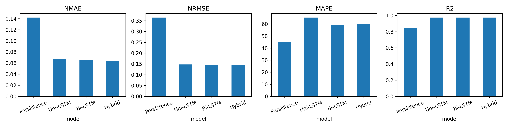
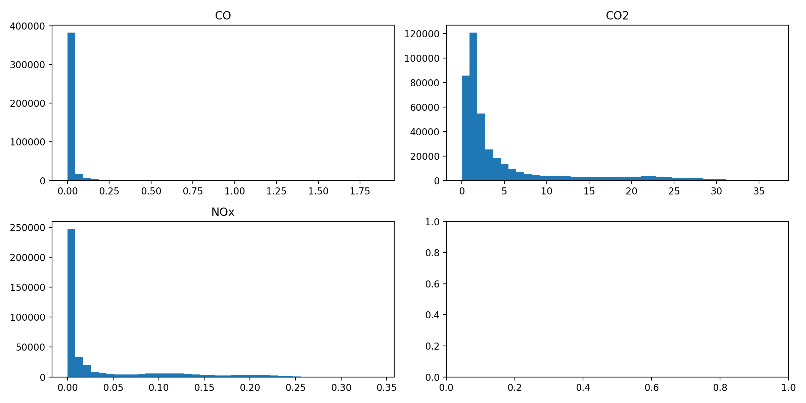
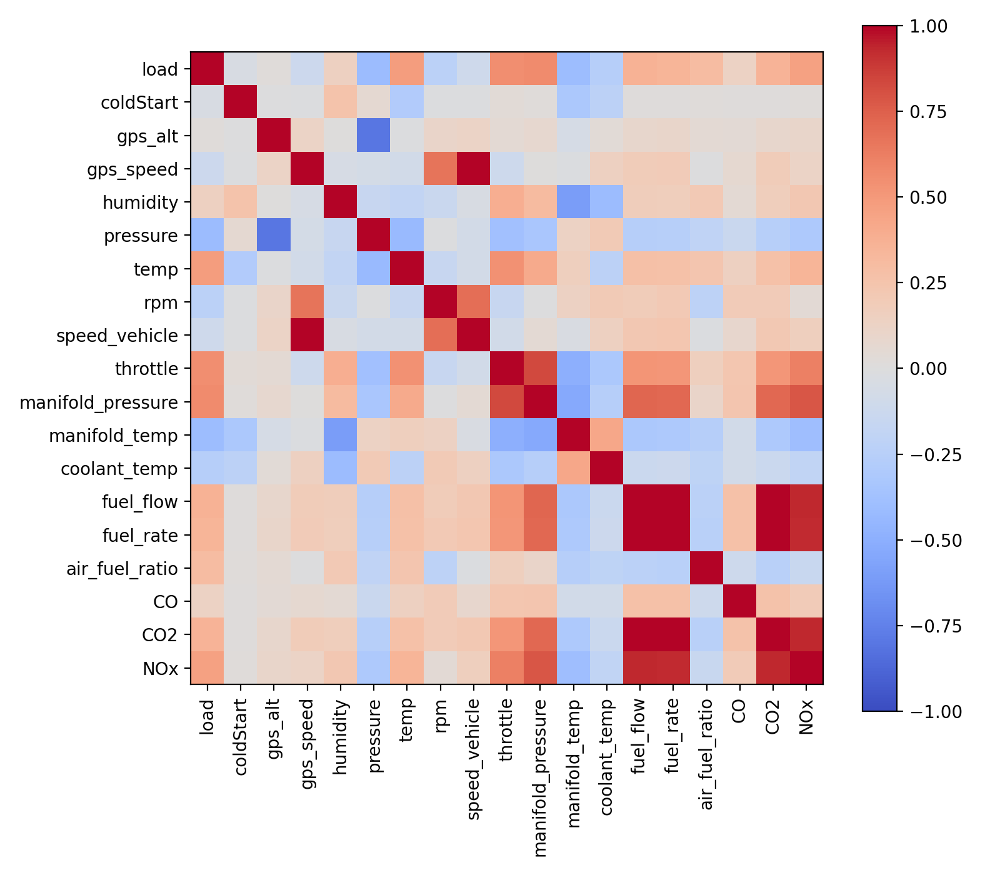
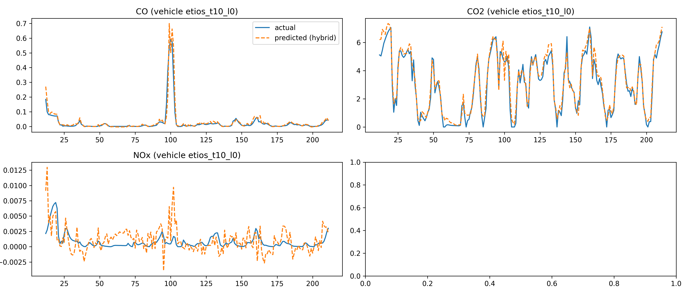
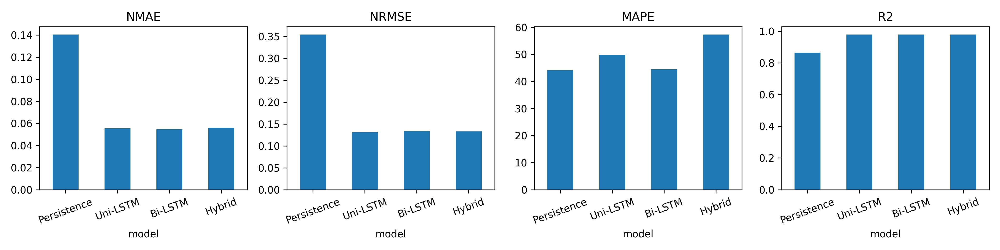
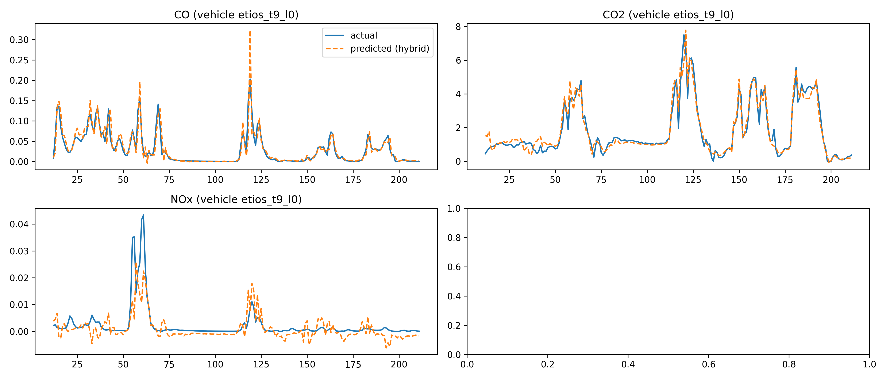
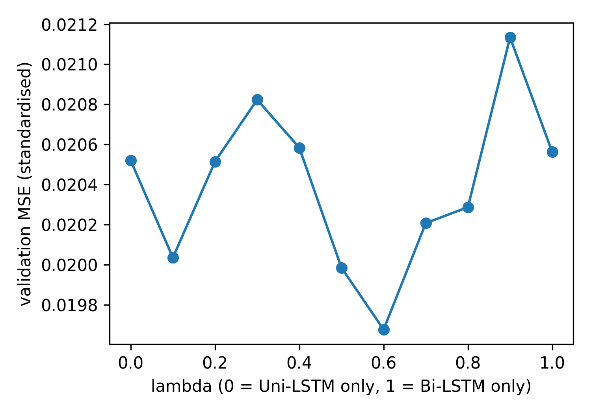
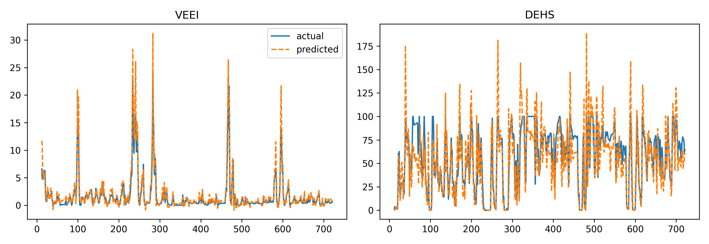

# Vehicle Emission Intelligence

### Deep Learning for Real-World Vehicle Emission Prediction and Intelligent Emission Assessment

**Vehicle Emission Intelligence (VEI)** is an end-to-end deep learning system that predicts vehicle exhaust emissions from real-world driving data and turns those predictions into interpretable emission indicators.

The project models the temporal relationship between **vehicle operating conditions, environmental conditions and pollutant emissions** with recurrent neural networks. It compares three LSTM architectures (Uni-LSTM, Bi-LSTM and a Hybrid Uni/Bi-LSTM) against a non-learned persistence baseline, and extends prediction into two higher-level indicators: **Vehicle Exhaust Emission Intelligence (VEEI)** and the **Driver/Vehicle Emission Health Score (DEHS)**.

> **Driving Behaviour → Vehicle State → Emission Prediction → Emission Intelligence → Interpretable Assessment**

<p align="center">
  
</p>

---

## Table of Contents

1. [Headline results](#1-headline-results)
2. [Overview and problem](#2-overview-and-problem)
3. [Project workflow, start to finish](#3-project-workflow-start-to-finish)
4. [System pipeline](#4-system-pipeline)
5. [Dataset](#5-dataset)
6. [Preprocessing, features and splits](#6-preprocessing-features-and-splits)
7. [Models](#7-models)
8. [Training setup](#8-training-setup)
9. [Experiments performed](#9-experiments-performed)
10. [Results](#10-results)
11. [VEEI and DEHS](#11-veei-and-dehs)
12. [Key findings and honest limitations](#12-key-findings-and-honest-limitations)
13. [Traceability to reviewer comments](#13-traceability-to-reviewer-comments)
14. [How to reproduce](#14-how-to-reproduce)
15. [Dashboard](#15-dashboard)
16. [Testing](#16-testing)
17. [Repository layout](#17-repository-layout)
18. [Index of all figures and tables](#18-index-of-all-figures-and-tables)
19. [Citation, licence and author](#19-citation-licence-and-author)

---

## 1. Headline results

Test-set results, predicting the next second (t+1) of CO, CO₂ and NOx from the previous 12 seconds. Macro-average over the three pollutants; NRMSE and NMAE are normalised by the standard deviation of the true values. Lower is better except R².

**Within-trip split, mean ± std over 3 seeds (42, 43, 44)** (`results/tables/table_metrics_seeds.csv`; persistence is deterministic, so it has one value):

| Model | NMAE | NRMSE | R² | MAPE (%) |
|---|---|---|---|---|
| Persistence baseline | 0.1421 | 0.3648 | 0.8495 | 45.13 |
| Uni-LSTM | 0.0662 ± 0.0012 | 0.1461 ± 0.0015 | 0.9748 ± 0.0006 | 64.26 ± 3.73 |
| Bi-LSTM | 0.0651 ± 0.0004 | 0.1462 ± 0.0019 | 0.9746 ± 0.0007 | 62.01 ± 2.47 |
| Hybrid (λ = 0.6) | 0.0647 ± 0.0006 | 0.1464 ± 0.0025 | 0.9743 ± 0.0011 | 61.82 ± 2.79 |

**By-trip split (whole trips held out, seed 42)** (`results_bytrip/tables/table_metrics.csv`):

| Model | NMAE | NRMSE | R² | MAPE (%) |
|---|---|---|---|---|
| Persistence baseline | 0.1406 | 0.3548 | 0.8658 | 44.16 |
| Uni-LSTM | 0.0556 | 0.1317 | 0.9799 | 49.88 |
| Bi-LSTM | 0.0546 | 0.1338 | 0.9790 | 44.50 |
| Hybrid (λ = 0.6) | 0.0561 | 0.1329 | 0.9792 | 57.38 |

What these numbers say, in plain terms:

* All three LSTMs cut normalised error to roughly **40% of the persistence baseline** (NRMSE ≈ 0.146 vs 0.365) and lift R² from 0.85 to 0.975. Sequence learning adds real predictive information beyond "next value = current value".
* The **three LSTM variants are statistically indistinguishable** on the macro metrics: their differences are smaller than the seed-to-seed standard deviation. The hybrid gives a small, consistent gain on NOx MAE (see [Section 10.2](#102-multi-seed-robustness-seeds-42-43-44)), but not an overall win.
* Persistence has the **lowest MAPE**. This is an artefact of MAPE on near-zero pollutant values, not evidence that persistence is more accurate (see [limitations](#12-key-findings-and-honest-limitations)).
* Performance holds up on **unseen trips**, so the models are not merely memorising trips seen in training.
* VEEI computed from predictions tracks VEEI from measurements with **r = 0.995** across 60,767 test steps ([Section 11](#11-veei-and-dehs)).

---

## 2. Overview and problem

Vehicle emissions are dynamic. Acceleration, engine speed, engine load, fuel consumption, ambient conditions and other driving variables continuously influence pollutant production. Treating each emission measurement as an independent observation misses these temporal patterns, so the project frames the task as **multivariate time-series forecasting**.

Traditional emission analysis mostly measures emissions after they occur. This project asks:

> **Can vehicle operating conditions be used to predict upcoming emissions and provide an interpretable assessment of emission behaviour?**

It addresses three connected problems:

1. **Emission prediction:** predict future pollutant emission rates (CO, CO₂, NOx, in g/s) from recent vehicle and environmental measurements.
2. **Temporal modelling:** capture relationships across consecutive observations rather than treating them independently.
3. **Emission intelligence:** convert predicted pollutant levels into interpretable vehicle-level indicators (VEEI and DEHS).

---

## 3. Project workflow, start to finish

Everything in this repository was produced by the following sequence. Each step names the code that does it and the files it writes.

| Step | What was done | Code | Outputs |
|---|---|---|---|
| 1 | **Acquire and merge the raw data.** Three PEMS CSVs (Etios, Figo, Isuzu RRV) parsed, resampled to 1 Hz, split into trip series at gaps > 5 s, exhaust-side columns dropped, tiny negative analyser readings clipped to 0. | `src/data/merge_raw.py` | `data/raw/emissions.csv`, `results/tables/merge_report.csv` |
| 2 | **Explore and validate the data.** Row counts, missing values, duplicates, summary statistics, pollutant histograms, correlation matrix. | `src/data/analyze_data.py`, `notebooks/01_data_analysis.ipynb` | `results/tables/{cleaning_report,dataset_summary,dataset_statistics,missing_values,counts_vehicle}.csv`, `results/figures/{pollutant_distribution,correlation_matrix}.png` |
| 3 | **Split, scale and window.** 70/15/15 within-trip split, train-only `StandardScaler`s, 12 s windows to a 1 s target. | `src/data/{split,preprocess,sequences,load_data}.py`, `notebooks/02_preprocessing.ipynb` | `data/processed/`, `results/tables/split_report.csv` |
| 4 | **Persistence baseline** (`ŷ(t+1) = y(t)`). | `src/evaluation/baseline.py` | `results/metrics/persistence.csv`, `experiments/persistence/` |
| 5 | **Train Uni-LSTM and Bi-LSTM** (seed 42). | `src/models/{uni,bi}_lstm.py`, `src/training/train_{uni,bi}.py` | `experiments/{uni,bi}_lstm/`, `results/metrics/{uni,bi}_lstm.csv` |
| 6 | **Search the hybrid fusion weight λ** over 11 values, scored on validation MSE. | `src/training/train_hybrid.py` | `experiments/lambda_search/`, `results/figures/fig_lambda_vs_error.png` |
| 7 | **Train the Hybrid LSTM** with the selected λ = 0.6. | `src/models/hybrid_lstm.py` | `experiments/hybrid_lstm/`, `results/metrics/hybrid_lstm.csv` |
| 8 | **Evaluate and ablate** Persistence vs Uni vs Bi vs Hybrid; plot comparison and actual-vs-predicted. | `src/evaluation/`, `src/visualization/` | `results/tables/table_metrics.csv`, `results/ablation/ablation_results.csv`, `results/figures/` |
| 9 | **Robustness across seeds** 43 and 44 (λ fixed), aggregate to mean ± std. | `src/run_everything.py` (phase 2) | `experiments_seed4{3,4}/`, `results/*_seed4{3,4}/`, `results/tables/table_metrics_seeds.csv` |
| 10 | **Stricter by-trip evaluation**: whole trips held out, stratified by vehicle. | `configs/by_trip.yaml`, `src/run_everything.py` (phase 3) | `experiments_bytrip/`, `results_bytrip/` |
| 11 | **Emission intelligence**: VEEI and DEHS from the Hybrid test predictions, with sourced limits, weights and β. | `src/emission/{veei,dehs}.py` | `results/tables/{veei_dehs,table_veei_parameters}.csv`, `results/figures/fig_veei_dehs.png` |
| 12 | **Dashboard** over the saved VEEI/DEHS table. | `dashboard/app.py` | Flask app on port 5000 |
| 13 | **Tests** for leakage, metrics, shapes, splits, baseline, devices. | `tests/` | `pytest tests/` |
| 14 | **Paper traceability**: reviewer comments mapped to evidence files. | `paper/reviewer_response/` | see [Section 13](#13-traceability-to-reviewer-comments) |

---

## 4. System pipeline

```text
┌──────────────────────────────────────────┐
│          Real-World Driving Data         │
│  (Pretoria PEMS data: 3 vehicles, 68     │
│   trips, 5 Hz / 1 Hz raw logging)        │
└─────────────────────┬────────────────────┘
                      ▼
┌──────────────────────────────────────────┐
│        Data Processing & Cleaning        │
│ Timestamp parsing • 1 Hz resampling      │
│ Trip series • gap splitting (> 5 s)      │
│ Exhaust-side column removal (leakage)    │
│ Train-only standardisation               │
└─────────────────────┬────────────────────┘
                      ▼
┌──────────────────────────────────────────┐
│          Time-Series Sequences           │
│  12 s history window → next-second target│
└─────────────────────┬────────────────────┘
                      │
          ┌───────────┼───────────┐
          ▼           ▼           ▼
      Uni-LSTM     Bi-LSTM    Hybrid LSTM      + Persistence baseline
          └───────────┼───────────┘
                      ▼
┌──────────────────────────────────────────┐
│         Multi-Pollutant Prediction       │
│              CO • CO₂ • NOx              │
└─────────────────────┬────────────────────┘
                      ▼
┌──────────────────────────────────────────┐
│          Emission Intelligence           │
│        VEEI → DEHS → Vehicle Insight     │
└─────────────────────┬────────────────────┘
                      ▼
┌──────────────────────────────────────────┐
│        Interactive Vehicle Dashboard     │
└──────────────────────────────────────────┘
```

---

## 5. Dataset

This project uses the **Real Driving Emissions Data: University of Pretoria (Version 5)** dataset published on Mendeley Data by Johan W. Joubert. It contains on-road emissions measured with a **Portable Emissions Measurement System (PEMS, SEMTECH DS+)** together with vehicle diagnostics and ambient conditions.

* **Dataset:** [Real driving emissions data: University of Pretoria, Version 5](https://data.mendeley.com/datasets/y9pjtt5ngc/5)
* **DOI:** `10.17632/y9pjtt5ngc.5`
* **Licence:** CC BY 4.0
* **Collection period:** 2021-02-02 to 2022-12-10
* **Full description and processing notes:** [`data/metadata/dataset_description.md`](data/metadata/dataset_description.md); per-feature dictionary: [`data/metadata/feature_dictionary.csv`](data/metadata/feature_dictionary.csv)

### 5.1 Vehicles and trips

| Vehicle | Type | Trips | Raw rows | Rows after 1 Hz resampling | Native rate |
|---|---|---|---|---|---|
| Toyota Etios 1.5 | Light passenger car | 10 | 273,493 | 54,711 | 5 Hz |
| Ford Figo 1.5 | Light passenger car | 30 | 167,559 | 167,559 | 1 Hz |
| Isuzu FTR850 AMT (`rrv`) | Medium heavy road-rail vehicle | 28 | 749,039 | 191,701 | mixed 1 Hz / 5 Hz |
| **Total** | 3 vehicle categories | **68** | **1,190,091** | **413,971** | resampled to 1 Hz |

The Isuzu truck was also tested at three payloads (0 / 1500 / 3000 kg), which is why the trip series are named `<vehicle>_t<trip>_l<load>`. The 68 trips break into **165 series** after splitting at gaps longer than 5 s.

Merge report (`results/tables/merge_report.csv`):

| Vehicle | Raw rows | Rows @ 1 Hz | Trips | Series (after gap split) | Gap splits | Target rows clipped to 0 | First timestamp | Last timestamp |
|---|---|---|---|---|---|---|---|---|
| etios | 273,493 | 54,711 | 10 | 12 | 2 | 2,921 | 2022-11-15 08:34:17 | 2022-11-17 10:56:14 |
| figo | 167,559 | 167,559 | 30 | 38 | 8 | 2,714 | 2021-07-27 10:03:03 | 2021-09-08 15:02:10 |
| rrv | 749,039 | 191,701 | 28 | 115 | 87 | 237 | 2021-02-02 10:09:42 | 2022-12-10 11:45:13 |

### 5.2 Data quality

Every cleaning stage keeps all 413,971 rows; there are **0 missing values** and **0 duplicate rows** after merging (`results/tables/cleaning_report.csv`, `results/tables/missing_values.csv`). Tiny negative analyser readings on the target columns (etios 2,921 rows; figo 2,714; rrv 237) were clipped to 0 during merging.

Cleaning report:

| Step | Rows kept |
|---|---|
| raw | 413,971 |
| valid_timestamp | 413,971 |
| no_duplicates | 413,971 |
| after_missing_handling | 413,971 |

Dataset summary (`results/tables/dataset_summary.csv`):

| Item | Value |
|---|---|
| rows | 413971 |
| columns | 22 |
| series (`series_id`; the file labels this "vehicles") | 165 |
| duplicate_rows | 0 |
| total_missing_cells | 0 |
| time_first | 2021-02-02 10:09:42 |
| time_last | 2022-12-10 11:45:13 |

### 5.3 Variables

* **Targets:** CO, CO₂, NOx (g/s). HC, SO₂ and PM are *not* measured in this dataset, so the project claims three pollutants only.
* **Vehicle and operating inputs (16):** `load`, `coldStart`, `gps_alt`, `gps_speed`, `humidity`, `pressure`, `temp`, `rpm`, `speed_vehicle`, `throttle`, `manifold_pressure`, `manifold_temp`, `coolant_temp`, `fuel_flow`, `fuel_rate`, `air_fuel_ratio`.
* **Vehicle identity:** one-hot `vehicle_etios`, `vehicle_figo`, `vehicle_rrv`.
* **Past pollutant values:** CO, CO₂, NOx from the previous steps are also fed as inputs (`include_targets_as_inputs: true`). This is what makes the persistence baseline a fair comparison. Exhaust-side analyser columns other than the targets are removed to avoid target leakage.

Feature dictionary (`data/metadata/feature_dictionary.csv`):

| Column | Role | Unit | Description |
|---|---|---|---|
| `series_id` | identifier |  | vehicle+trip(+segment) id; splits are made within each series |
| `timestamp` | time | s | 1 Hz timestamp |
| `vehicle` | categorical |  | etios | figo | rrv (one-hot encoded) |
| `load` | feature | kg | added payload (rrv only; 0 otherwise) |
| `coldStart` | feature | 0/1 | cold-start trip flag |
| `gps_alt` | feature | m | GPS altitude |
| `gps_speed` | feature | km/h | GPS speed |
| `humidity` | feature | % | ambient humidity |
| `pressure` | feature | hPa | ambient pressure |
| `temp` | feature | degC | ambient temperature |
| `rpm` | feature | rpm | engine speed |
| `speed_vehicle` | feature | km/h | vehicle speed (ECU) |
| `throttle` | feature | % | throttle position |
| `manifold_pressure` | feature |  | intake manifold pressure |
| `manifold_temp` | feature | degC | intake manifold temperature |
| `coolant_temp` | feature | degC | coolant temperature |
| `fuel_flow` | feature |  | fuel flow |
| `fuel_rate` | feature |  | fuel rate |
| `air_fuel_ratio` | feature |  | air-fuel ratio |
| `CO` | target | g/s | CO mass rate (CO_mass) |
| `CO2` | target | g/s | CO2 mass rate (CO2_mass) |
| `NOx` | target | g/s | NOx mass rate (NOx_mass) |

### 5.4 Summary statistics

Merged data, 413,971 rows (`results/tables/dataset_statistics.csv`):

| Column | Mean | Std | Min | Median | Max |
|---|---|---|---|---|---|
| load | 759.1 | 1150 | 0 | 0 | 3000 |
| coldStart | 0.2683 | 0.4431 | 0 | 0 | 1 |
| gps_alt | 1377 | 74.29 | 0 | 1368 | 1562 |
| gps_speed | 35.98 | 25.64 | 0 | 38.3 | 140 |
| humidity | 45.02 | 18.44 | 6.2 | 44.26 | 97.4 |
| pressure | 873.2 | 9.142 | 847 | 874 | 895 |
| temp | 22.33 | 5.056 | 10.4 | 22.9 | 33.6 |
| rpm | 1561 | 681.8 | 0 | 1526 | 5326 |
| speed_vehicle | 36.18 | 25.74 | 0 | 38.73 | 139.2 |
| throttle | 53.11 | 37.01 | 0 | 34.9 | 100 |
| manifold_pressure | 75.04 | 42.51 | 0 | 77.92 | 189.6 |
| manifold_temp | 34.29 | 7.365 | 0 | 33.6 | 63 |
| coolant_temp | 87.2 | 7.874 | 0 | 86 | 102 |
| fuel_flow | 1.578 | 2.25 | -0.593 | 0.58 | 11.63 |
| fuel_rate | 0.000504 | 0.0006958 | -0.000209 | 0.000192 | 0.003612 |
| air_fuel_ratio | 71.74 | 115.4 | 12.33 | 22.77 | 450 |
| CO | 0.0172 | 0.0493 | 0 | 0.004288 | 1.861 |
| CO2 | 4.952 | 7.089 | 0 | 1.834 | 36.63 |
| NOx | 0.03496 | 0.06144 | 0 | 0.00179 | 0.3412 |

### 5.5 Distributions and correlations

<p align="center">
  
  
</p>

*Left: `results/figures/pollutant_distribution.png`. CO, CO₂ and NOx are strongly right-skewed with a large mass of near-zero values (CO reaches about 1.86 g/s but its median is 0.0043 g/s). The empty fourth panel is a known cosmetic issue. Right: `results/figures/correlation_matrix.png`. Pearson correlations across all numeric columns: `fuel_flow`, `fuel_rate` and CO₂ are almost perfectly correlated with each other, NOx is strongly related to them and to `throttle` and `manifold_pressure`, and CO is only weakly correlated with any single input, which is consistent with CO being the hardest target.*

---

## 6. Preprocessing, features and splits

Implemented in `src/data/` (`merge_raw.py`, `analyze_data.py`, `preprocess.py`, `split.py`, `sequences.py`).

1. **Merge** the three Pretoria CSVs into one file, `data/raw/emissions.csv` (`python -m src.data.merge_raw`): parse timestamps, resample to 1 Hz by per-second mean, build one series per trip, split at gaps longer than 5 s, drop exhaust-side columns, clip tiny negative analyser noise to 0.
2. **Split** into train / validation / test (70 / 15 / 15).
3. **Standardise** inputs and targets with `StandardScaler`s **fitted on training rows only**.
4. **Window** each series into sequences of 12 steps (`sequence_length: 12`) that predict the next second (`prediction_horizon: 1`). Windows never cross split, vehicle or trip boundaries.

Two split strategies were run:

| | Within-trip (default) | By-trip (stricter) |
|---|---|---|
| Idea | Each series is cut in time order into train / val / test | Whole trips are assigned to one split, so test trips are never seen in training |
| Config | `configs/data.yaml` | `configs/by_trip.yaml` |
| Trips (train / val / test) | n/a | 48 / 9 / 11 |
| Output folders | `results/`, `experiments/` | `results_bytrip/`, `experiments_bytrip/` |

Rows, sequences and series per partition (`results/tables/split_report.csv`, `results_bytrip/tables/split_report.csv`):

| Partition | Within-trip: rows | sequences | series | By-trip: rows | sequences  | series  |
|---|---|---|---|---|---|---|
| Train | 289,203 | 287,883 | 110 | 291,411 | 290,216 | 121 |
| Validation | 61,939 | 60,619 | 110 | 57,321 | 57,114 | 20 |
| Test | 62,087 | 60,767 | 110 | 65,239 | 64,995 | 24 |

In the within-trip split, 110 of the 165 series were long enough to contribute to all three partitions.

By-trip assignment is **stratified by vehicle** so every vehicle contributes trips to train, validation and test (fragments of one trip always stay together, and the assignment is deterministic for a given seed). Counts from `results_bytrip/tables/trip_assignment.csv`:

| Vehicle | Train trips | Val trips | Test trips | Test rows (trip rows) |
|---|---|---|---|---|
| Etios | 7 | 1 | 2 | 10,636 |
| Figo | 21 | 4 | 5 | 27,591 |
| RRV (Isuzu) | 20 | 4 | 4 | 27,012 |

Held-out **test** trips:

| Test trip | Vehicle | Rows |
|---|---|---|
| etios_t9_l0 | etios | 4988 |
| etios_t8_l0 | etios | 5648 |
| figo_t16_l0 | figo | 5564 |
| figo_t4_l0 | figo | 5227 |
| figo_t23_l0 | figo | 5640 |
| figo_t13_l0 | figo | 5790 |
| figo_t26_l0 | figo | 5370 |
| rrv_t14_l3000 | rrv | 6456 |
| rrv_t24_l1500 | rrv | 7034 |
| rrv_t13_l3000 | rrv | 7111 |
| rrv_t4_l0 | rrv | 6411 |

Held-out **validation** trips:

| Val trip | Vehicle | Rows |
|---|---|---|
| etios_t4_l0 | etios | 6161 |
| figo_t27_l0 | figo | 5481 |
| figo_t20_l0 | figo | 5610 |
| figo_t30_l0 | figo | 5630 |
| figo_t10_l0 | figo | 6442 |
| rrv_t3_l0 | rrv | 6981 |
| rrv_t29_l1500 | rrv | 7012 |
| rrv_t11_l3000 | rrv | 7035 |
| rrv_t15_l3000 | rrv | 6969 |

### 6.1 Leakage controls

* Scalers are fitted on training data only.
* Windows do not cross split, vehicle or trip boundaries (unit-tested, see [Testing](#16-testing)).
* The hybrid parameter λ is chosen on **validation** loss, never on the test set.
* Early stopping uses validation loss; the test set is touched once per model for final evaluation.
* Exhaust-side measurements other than the targets are excluded from the inputs.

---

## 7. Models

All models are PyTorch LSTMs with identical size and training settings, so the ablation is fair (`src/models/`).

### 7.1 Uni-LSTM

```text
Past vehicle states (12 s) → LSTM (64 hidden) → Dense → CO / CO₂ / NOx
```

A chronological temporal baseline. 22,723 parameters.

### 7.2 Bi-LSTM

```text
Past vehicle states (12 s) → Forward LSTM + Backward LSTM → Dense → CO / CO₂ / NOx
```

Reads each 12 s input window in both directions. 45,443 parameters.

### 7.3 Hybrid LSTM

```text
                 Input window (12 s)
                       │
             ┌─────────┴─────────┐
             ▼                   ▼
          Uni-LSTM            Bi-LSTM
             │                   │
             │         Linear projection (2h → h)
             │                   │
             └─────────┬─────────┘
                       ▼
        H = λ · H_Bi + (1 − λ) · H_Uni
                       │
                       ▼
                 Dense layer → CO / CO₂ / NOx
```

`λ` is a **fixed scalar** in [0, 1] chosen on the validation set. `λ = 1` is the Bi-LSTM branch alone and `λ = 0` the Uni-LSTM branch alone. The Bi-LSTM state (2 × hidden) is projected to `hidden` so both branches share a space before fusion. A branch with weight exactly 0 is skipped, so the two extremes cost half as much. 76,035 parameters at λ = 0.6.

### 7.4 Persistence baseline (non-learned)

```text
Predicted(t+1) = Observed(t)
```

The reference for whether the LSTMs learn anything beyond "the next value resembles the current one".

---

## 8. Training setup

Source: `configs/*.yaml`, `results/tables/table_model_config.csv`, `experiments/*/config.yaml`.

| Setting | Value |
|---|---|
| Hidden units / layers / dropout | 64 / 1 / 0.0 |
| Optimiser / loss | Adam / MSE on standardised targets |
| Learning rate / weight decay | 0.001 / 0.0 |
| Batch size / max epochs | 64 / 100 |
| Early stopping | patience 12 epochs on validation loss |
| Gradient clipping | 1.0 |
| Sequence length / horizon | 12 s / 1 s |
| Seeds | 42 (main), 43, 44 (robustness) |
| Hardware | NVIDIA GeForce GTX 1650 laptop GPU, PyTorch 2.5.1 + CUDA 12.1, no mixed precision |

### 8.1 Every final training run

Parameter counts, best validation loss (MSE on standardised targets), best epoch, epochs actually run before early stopping, and wall-clock time. Sources: `experiments*/<model>/history.json` and `training.log`.

| Run | Model | Params | Best val MSE | Best epoch | Epochs run | Train time (s) |
|---|---|---|---|---|---|---|
| within-trip, seed 42 | Uni-LSTM | 22,723 | 0.021518 | 26 | 38 | 592.1 |
| within-trip, seed 42 | Bi-LSTM | 45,443 | 0.021227 | 26 | 38 | 502.2 |
| within-trip, seed 42 | Hybrid (λ = 0.6) | 76,035 | 0.019676 | 27 | 39 | 758.0 |
| within-trip, seed 43 | Uni-LSTM | 22,723 | 0.020865 | 39 | 51 | 575.1 |
| within-trip, seed 43 | Bi-LSTM | 45,443 | 0.020938 | 26 | 38 | 586.0 |
| within-trip, seed 43 | Hybrid (λ = 0.6) | 76,035 | 0.020338 | 31 | 43 | 999.6 |
| within-trip, seed 44 | Uni-LSTM | 22,723 | 0.021621 | 23 | 35 | 392.2 |
| within-trip, seed 44 | Bi-LSTM | 45,443 | 0.020977 | 28 | 40 | 524.7 |
| within-trip, seed 44 | Hybrid (λ = 0.6) | 76,035 | 0.020430 | 36 | 48 | 918.9 |
| by-trip, seed 42 | Uni-LSTM | 22,723 | 0.015599 | 45 | 57 | 631.8 |
| by-trip, seed 42 | Bi-LSTM | 45,443 | 0.015941 | 55 | 67 | 892.8 |
| by-trip, seed 42 | Hybrid (λ = 0.6) | 76,035 | 0.015066 | 48 | 60 | 1315.5 |

By-trip runs trained longer before stopping (best epochs 45 to 55) than the within-trip runs (best epochs 23 to 39). The absolute validation losses are not comparable across the two splits because the validation sets contain different data.

### 8.2 The 11 λ-search runs

Each of the 11 hybrid runs is a full training run with seed 42 (`experiments/lambda_search/lam_*/`; the per-λ folders are git-ignored, so only `lambda_results.csv` and `best_lambda.json` are tracked).

|  |
||

---

## 9. Experiments performed

Every experiment below was run end to end with `python -m src.run_everything` (phases 1 to 3), on the same laptop.

| # | Experiment | What was varied | Where the outputs are |
|---|---|---|---|
| E1 | Data merge, cleaning and analysis | n/a | `results/tables/{merge_report,cleaning_report,dataset_summary,dataset_statistics,missing_values,counts_vehicle}.csv`, `results/figures/{pollutant_distribution,correlation_matrix}.png` |
| E2 | Persistence baseline | none (deterministic) | `results/metrics/persistence.csv`, `experiments/persistence/metrics_val.csv` |
| E3 | Uni-LSTM and Bi-LSTM, seed 42 | architecture | `experiments/{uni,bi}_lstm/`, `results/metrics/{uni,bi}_lstm.csv` |
| E4 | **λ search** for the Hybrid, 11 values (0.0 to 1.0, step 0.1), scored on validation MSE | λ | `experiments/lambda_search/lambda_results.csv`, `best_lambda.json`, `results/figures/fig_lambda_vs_error.png` |
| E5 | Hybrid LSTM with the chosen λ = 0.6, seed 42 | n/a | `experiments/hybrid_lstm/`, `results/metrics/hybrid_lstm.csv` |
| E6 | **Ablation** (Persistence vs Uni vs Bi vs Hybrid) | model | `results/ablation/ablation_results.csv`, `results/tables/table_metrics.csv` |
| E7 | **Extra seeds** 43 and 44 (λ fixed at 0.6) | random seed | `experiments_seed4{3,4}/`, `results/{metrics,predictions,tables,ablation}_seed4{3,4}/`, aggregate `results/tables/table_metrics_seeds.csv` |
| E8 | **By-trip split** (whole trips held out, λ = 0.6) | split strategy | `experiments_bytrip/`, `results_bytrip/` |
| E9 | VEEI and DEHS scoring of the Hybrid test predictions | limits, weights, β | `results/tables/{veei_dehs,table_veei_parameters}.csv`, `results/figures/fig_veei_dehs.png` |

Note that the seed-43/44 and by-trip runs use **the λ chosen on seed 42**; λ was not re-tuned per seed or per split.

Total runs trained: 3 model types × 3 seeds (within-trip) + 3 (by-trip) + 11 λ-search runs, where the seed-42 Hybrid is the λ = 0.6 run of the search.

---

## 10. Results

All figures below are on held-out **test** data unless stated. Full per-pollutant tables are in the CSV files named beside each table.

### 10.1 Main results (within-trip split, seed 42)

Source: `results/tables/table_metrics.csv`. MAE and RMSE are in g/s for each pollutant.

| Model | Pollutant | MAE (g/s) | RMSE (g/s) | MAPE (%) | R² | NMAE | NRMSE |
|---|---|---|---|---|---|---|---|
| Persistence | CO | 0.00748 | 0.02432 | 47.07 | 0.7084 | 0.1662 | 0.5400 |
| Persistence | CO₂ | 1.19848 | 2.45726 | 44.41 | 0.8895 | 0.1621 | 0.3324 |
| Persistence | NOx | 0.00647 | 0.01467 | 43.91 | 0.9507 | 0.0979 | 0.2221 |
| **Persistence** | **Macro avg** |  |  | 45.13 | 0.8495 | 0.1421 | 0.3648 |
| Uni-LSTM | CO | 0.00430 | 0.01070 | 100.64 | 0.9436 | 0.0954 | 0.2375 |
| Uni-LSTM | CO₂ | 0.42245 | 0.76117 | 29.45 | 0.9894 | 0.0571 | 0.1030 |
| Uni-LSTM | NOx | 0.00332 | 0.00677 | 65.97 | 0.9895 | 0.0502 | 0.1024 |
| **Uni-LSTM** | **Macro avg** |  |  | 65.35 | 0.9742 | 0.0676 | 0.1476 |
| Bi-LSTM | CO | 0.00406 | 0.01047 | 90.50 | 0.9460 | 0.0901 | 0.2324 |
| Bi-LSTM | CO₂ | 0.40615 | 0.73320 | 29.30 | 0.9902 | 0.0549 | 0.0992 |
| Bi-LSTM | NOx | 0.00325 | 0.00680 | 57.98 | 0.9894 | 0.0493 | 0.1029 |
| **Bi-LSTM** | **Macro avg** |  |  | 59.26 | 0.9752 | 0.0648 | 0.1448 |
| Hybrid | CO | 0.00405 | 0.01057 | 90.03 | 0.9449 | 0.0899 | 0.2346 |
| Hybrid | CO₂ | 0.40978 | 0.74810 | 27.73 | 0.9898 | 0.0554 | 0.1012 |
| Hybrid | NOx | 0.00313 | 0.00659 | 61.10 | 0.9900 | 0.0474 | 0.0998 |
| **Hybrid** | **Macro avg** |  |  | 59.62 | 0.9749 | 0.0642 | 0.1452 |

Pollutant-level reading: CO is the hardest target (R² ≈ 0.945, NRMSE ≈ 0.23) because it is spiky and near zero most of the time. CO₂ and NOx are predicted much more accurately (NRMSE ≈ 0.10, R² ≈ 0.99).


*`results/figures/fig_model_comparison.png`: NMAE, NRMSE, MAPE and R² by model (macro average). The LSTMs clearly beat persistence on NMAE, NRMSE and R²; the MAPE panel goes the other way (see limitations).*



*`results/figures/fig_actual_vs_predicted.png`: Hybrid predictions against measurements for the first 200 test steps of `etios_t10_l0`. CO and CO₂ are tracked closely including the CO spike near step 100; NOx is noisier at very low levels (its values are of order 0.001 to 0.01 g/s) and the prediction dips below zero in places. The empty fourth panel and unlabeled axes are a known cosmetic issue.*

### 10.2 Multi-seed robustness (seeds 42, 43, 44)

Source: `results/tables/table_metrics_seeds.csv` (mean ± std over seeds 42, 43, 44; λ fixed at 0.6 for the Hybrid). Per-seed tables: `results/tables/table_metrics.csv`, `results/tables_seed43/`, `results/tables_seed44/`, and `results/ablation_seed4{3,4}/`.

Macro-average, mean ± std:

| Model | NMAE | NRMSE | R² | MAPE (%) |
|---|---|---|---|---|
| Uni-LSTM | 0.0662 ± 0.0012 | 0.1461 ± 0.0015 | 0.9748 ± 0.0006 | 64.26 ± 3.73 |
| Bi-LSTM | 0.0651 ± 0.0004 | 0.1462 ± 0.0019 | 0.9746 ± 0.0007 | 62.01 ± 2.47 |
| Hybrid | 0.0647 ± 0.0006 | 0.1464 ± 0.0025 | 0.9743 ± 0.0011 | 61.82 ± 2.79 |

MAE per pollutant (g/s), mean ± std:

| Model | CO MAE (g/s) | CO₂ MAE (g/s) | NOx MAE (g/s) |
|---|---|---|---|
| Uni-LSTM | 0.004155 ± 0.000127 | 0.4221 ± 0.0040 | 0.003253 ± 0.000071 |
| Bi-LSTM | 0.004071 ± 0.000016 | 0.4130 ± 0.0077 | 0.003237 ± 0.000021 |
| Hybrid | 0.004113 ± 0.000109 | 0.4095 ± 0.0085 | **0.003121 ± 0.000036** |

Full per-pollutant breakdown, mean ± std over 3 seeds:

| Model | Pollutant | NMAE | NRMSE | R² | MAPE (%) |
|---|---|---|---|---|---|
| Uni-LSTM | CO | 0.0923 ± 0.0028 | 0.2335 ± 0.0038 | 0.9455 ± 0.0018 | 90.59 ± 8.84 |
| Uni-LSTM | CO₂ | 0.0571 ± 0.0005 | 0.1025 ± 0.0006 | 0.9895 ± 0.0001 | 31.57 ± 1.90 |
| Uni-LSTM | NOx | 0.0492 ± 0.0011 | 0.1023 ± 0.0010 | 0.9895 ± 0.0002 | 70.63 ± 9.70 |
| Bi-LSTM | CO | 0.0904 ± 0.0004 | 0.2356 ± 0.0040 | 0.9445 ± 0.0019 | 93.70 ± 4.40 |
| Bi-LSTM | CO₂ | 0.0559 ± 0.0010 | 0.1007 ± 0.0017 | 0.9899 ± 0.0003 | 29.85 ± 0.53 |
| Bi-LSTM | NOx | 0.0490 ± 0.0003 | 0.1024 ± 0.0005 | 0.9895 ± 0.0001 | 62.48 ± 4.09 |
| Hybrid | CO | 0.0913 ± 0.0024 | 0.2387 ± 0.0065 | 0.9430 ± 0.0031 | 95.47 ± 8.39 |
| Hybrid | CO₂ | 0.0554 ± 0.0011 | 0.1006 ± 0.0013 | 0.9899 ± 0.0003 | 28.85 ± 2.51 |
| Hybrid | NOx | 0.0472 ± 0.0005 | 0.0999 ± 0.0001 | 0.9900 ± 0.0000 | 61.15 ± 1.49 |

Macro-average for each individual seed (to show the raw spread behind the mean ± std):

| Seed | Model | NMAE | NRMSE | R² | MAPE (%) |
|---|---|---|---|---|---|
| 42 | Persistence | 0.1421 | 0.3648 | 0.8495 | 45.13 |
| 42 | Uni-LSTM | 0.0676 | 0.1476 | 0.9742 | 65.35 |
| 42 | Bi-LSTM | 0.0648 | 0.1448 | 0.9752 | 59.26 |
| 42 | Hybrid | 0.0642 | 0.1452 | 0.9749 | 59.62 |
| 43 | Persistence | 0.1421 | 0.3648 | 0.8495 | 45.13 |
| 43 | Uni-LSTM | 0.0657 | 0.1446 | 0.9754 | 67.33 |
| 43 | Bi-LSTM | 0.0650 | 0.1455 | 0.9749 | 64.03 |
| 43 | Hybrid | 0.0653 | 0.1447 | 0.9750 | 64.96 |
| 44 | Persistence | 0.1421 | 0.3648 | 0.8495 | 45.13 |
| 44 | Uni-LSTM | 0.0653 | 0.1461 | 0.9749 | 60.11 |
| 44 | Bi-LSTM | 0.0655 | 0.1484 | 0.9738 | 62.74 |
| 44 | Hybrid | 0.0644 | 0.1492 | 0.9730 | 60.89 |

NOx MAE (g/s) for each seed. The Hybrid is lowest in every seed:

| Seed | Uni-LSTM | Bi-LSTM | Hybrid |
|---|---|---|---|
| 42 | 0.003316 | 0.003254 | 0.003130 |
| 43 | 0.003267 | 0.003213 | 0.003151 |
| 44 | 0.003176 | 0.003245 | 0.003081 |

Reading: on the macro metrics the three architectures are within one standard deviation of each other, and the ordering changes from seed to seed. The one consistent edge is the Hybrid's **NOx MAE**, about 3.6% lower than Bi-LSTM and about 4.1% lower than Uni-LSTM, with a small standard deviation. CO₂ MAE also trends slightly lower for the Hybrid but the gap is within seed noise. Only three seeds were run, so these are indicative rather than a formal significance test.

### 10.3 By-trip (unseen-trip) generalisation

Source: `results_bytrip/tables/table_metrics.csv`, `results_bytrip/ablation/ablation_results.csv`. Single seed (42), λ = 0.6, test set = 11 held-out trips.

| Model | Pollutant | MAE (g/s) | RMSE (g/s) | MAPE (%) | R² | NMAE | NRMSE |
|---|---|---|---|---|---|---|---|
| Persistence | CO | 0.00825 | 0.02636 | 45.57 | 0.7896 | 0.1436 | 0.4587 |
| Persistence | CO₂ | 1.22611 | 2.54925 | 42.70 | 0.8637 | 0.1776 | 0.3692 |
| Persistence | NOx | 0.00601 | 0.01412 | 44.22 | 0.9440 | 0.1008 | 0.2366 |
| **Persistence** | **Macro avg** |  |  | 44.16 | 0.8658 | 0.1406 | 0.3548 |
| Uni-LSTM | CO | 0.00397 | 0.01186 | 62.46 | 0.9574 | 0.0691 | 0.2063 |
| Uni-LSTM | CO₂ | 0.37165 | 0.67190 | 24.02 | 0.9905 | 0.0538 | 0.0973 |
| Uni-LSTM | NOx | 0.00262 | 0.00546 | 63.16 | 0.9916 | 0.0439 | 0.0915 |
| **Uni-LSTM** | **Macro avg** |  |  | 49.88 | 0.9799 | 0.0556 | 0.1317 |
| Bi-LSTM | CO | 0.00402 | 0.01221 | 60.02 | 0.9549 | 0.0699 | 0.2124 |
| Bi-LSTM | CO₂ | 0.36144 | 0.66873 | 23.50 | 0.9906 | 0.0523 | 0.0969 |
| Bi-LSTM | NOx | 0.00248 | 0.00549 | 49.99 | 0.9915 | 0.0415 | 0.0921 |
| **Bi-LSTM** | **Macro avg** |  |  | 44.50 | 0.9790 | 0.0546 | 0.1338 |
| Hybrid | CO | 0.00414 | 0.01218 | 86.29 | 0.9551 | 0.0721 | 0.2120 |
| Hybrid | CO₂ | 0.36427 | 0.66265 | 25.32 | 0.9908 | 0.0528 | 0.0960 |
| Hybrid | NOx | 0.00260 | 0.00541 | 60.52 | 0.9918 | 0.0436 | 0.0906 |
| **Hybrid** | **Macro avg** |  |  | 57.38 | 0.9792 | 0.0561 | 0.1329 |

Reading: accuracy on **completely unseen trips is as good as, or slightly better than,** the within-trip result (NRMSE 0.13 vs 0.146). This is a stricter test, so it supports the claim that the LSTMs generalise across trips. The by-trip test set contains different trips from the within-trip one, so the two sets of numbers are not directly comparable, and the ordering among the three LSTMs again lies within what seed noise could produce.



*`results_bytrip/figures/fig_model_comparison.png`: macro metrics on the 11 held-out test trips.*



*`results_bytrip/figures/fig_actual_vs_predicted.png`: Hybrid predictions on the first 200 steps of held-out trip `etios_t9_l0`, which the model never saw in training. The two NOx peaks are located correctly but the first is underestimated; the empty fourth panel is the same cosmetic issue.*

### 10.4 Ablation: does the Bi + Uni hybrid help?

Source: `results/ablation/ablation_results.csv` (seed 42), `results_bytrip/ablation/ablation_results.csv`. `NRMSE vs persistence` is the model's NRMSE divided by persistence NRMSE.

**Within-trip, seed 42:**

| Model | MAPE (%) | R² | NMAE | NRMSE | NRMSE vs persistence |
|---|---|---|---|---|---|
| Persistence | 45.13 | 0.8495 | 0.1421 | 0.3648 | 1.000 |
| Uni-LSTM | 65.35 | 0.9742 | 0.0676 | 0.1476 | 0.405 |
| Bi-LSTM | 59.26 | 0.9752 | 0.0648 | 0.1448 | 0.397 |
| Hybrid | 59.62 | 0.9749 | 0.0642 | 0.1452 | 0.398 |

**Within-trip, seed 43** (`results/ablation_seed43/ablation_results.csv`):

| Model | MAPE (%) | R² | NMAE | NRMSE | NRMSE vs persistence |
|---|---|---|---|---|---|
| Persistence | 45.13 | 0.8495 | 0.1421 | 0.3648 | 1.000 |
| Uni-LSTM | 67.33 | 0.9754 | 0.0657 | 0.1446 | 0.396 |
| Bi-LSTM | 64.03 | 0.9749 | 0.0650 | 0.1455 | 0.399 |
| Hybrid | 64.96 | 0.9750 | 0.0653 | 0.1447 | 0.397 |

**Within-trip, seed 44** (`results/ablation_seed44/ablation_results.csv`):

| Model | MAPE (%) | R² | NMAE | NRMSE | NRMSE vs persistence |
|---|---|---|---|---|---|
| Persistence | 45.13 | 0.8495 | 0.1421 | 0.3648 | 1.000 |
| Uni-LSTM | 60.11 | 0.9749 | 0.0653 | 0.1461 | 0.401 |
| Bi-LSTM | 62.74 | 0.9738 | 0.0655 | 0.1484 | 0.407 |
| Hybrid | 60.89 | 0.9730 | 0.0644 | 0.1492 | 0.409 |

**By-trip, seed 42:**

| Model | MAPE (%) | R² | NMAE | NRMSE | NRMSE vs persistence |
|---|---|---|---|---|---|
| Persistence | 44.16 | 0.8658 | 0.1406 | 0.3548 | 1.000 |
| Uni-LSTM | 49.88 | 0.9799 | 0.0556 | 0.1317 | 0.371 |
| Bi-LSTM | 44.50 | 0.9790 | 0.0546 | 0.1338 | 0.377 |
| Hybrid | 57.38 | 0.9792 | 0.0561 | 0.1329 | 0.375 |

Answer: every recurrent variant removes about 60% of persistence's normalised error. Adding the bidirectional branch to the unidirectional one gives a small improvement in NMAE and NOx error, but no significant improvement in NRMSE or R². The honest summary for the paper is that the hybrid is *competitive with and marginally better in places than* its components, not decisively better.

### 10.5 Selection of λ

Source: `experiments/lambda_search/lambda_results.csv`, `best_lambda.json`. Selection criterion: minimum validation MSE (standardised units), one run per λ, seed 42.

| λ | Val MSE (standardised) | Best epoch |
|---|---|---|
| 0.0 (Uni only) | 0.020520 | 31 |
| 0.1 | 0.020035 | 27 |
| 0.2 | 0.020515 | 24 |
| 0.3 | 0.020823 | 26 |
| 0.4 | 0.020583 | 27 |
| 0.5 | 0.019985 | 26 |
| **0.6** | **0.019676** | 27 |
| 0.7 | 0.020207 | 27 |
| 0.8 | 0.020287 | 27 |
| 0.9 | 0.021134 | 26 |
| 1.0 (Bi only) | 0.020562 | 27 |



*`results/figures/fig_lambda_vs_error.png`: validation MSE for each λ from 0 (Uni only) to 1 (Bi only).*

The chosen value is **λ = 0.6**. The curve is non-monotonic and shallow: the best and worst validation MSE differ by only about 7%, and the pure Uni (λ = 0) and pure Bi (λ = 1) endpoints sit at about 0.0205. This is weak evidence for a specific λ, so the paper should describe λ as a validated fusion weight and not claim an optimum.

### 10.6 Per-pollutant summary

| Pollutant | Persistence R² | Best LSTM R² (within-trip, seed 42) | Hybrid R² (by-trip) | Comment |
|---|---|---|---|---|
| CO | 0.7084 | 0.9460 (Bi-LSTM) | 0.9551 | Spiky, near zero most of the time; hardest target |
| CO₂ | 0.8895 | 0.9902 (Bi-LSTM) | 0.9908 | Smooth, strongly tied to fuel flow |
| NOx | 0.9507 | 0.9900 (Hybrid) | 0.9918 | Very small magnitudes; noisiest in the plots |

### 10.7 Extra per-seed metric tables

For completeness, the full per-pollutant tables for the two additional seeds (`results/tables_seed43/table_metrics.csv`, `results/tables_seed44/table_metrics.csv`).

<details>
<summary><b>Seed 43, within-trip</b></summary>

| Model | Pollutant | MAE (g/s) | RMSE (g/s) | MAPE (%) | R² | NMAE | NRMSE |
|---|---|---|---|---|---|---|---|
| Persistence | CO | 0.00748 | 0.02432 | 47.07 | 0.7084 | 0.1662 | 0.5400 |
| Persistence | CO₂ | 1.19848 | 2.45726 | 44.41 | 0.8895 | 0.1621 | 0.3324 |
| Persistence | NOx | 0.00647 | 0.01467 | 43.91 | 0.9507 | 0.0979 | 0.2221 |
| **Persistence** | **Macro avg** |  |  | 45.13 | 0.8495 | 0.1421 | 0.3648 |
| Uni-LSTM | CO | 0.00406 | 0.01035 | 87.09 | 0.9472 | 0.0901 | 0.2299 |
| Uni-LSTM | CO₂ | 0.42593 | 0.75952 | 33.11 | 0.9894 | 0.0576 | 0.1027 |
| Uni-LSTM | NOx | 0.00327 | 0.00669 | 81.79 | 0.9897 | 0.0495 | 0.1013 |
| **Uni-LSTM** | **Macro avg** |  |  | 67.33 | 0.9754 | 0.0657 | 0.1446 |
| Bi-LSTM | CO | 0.00409 | 0.01055 | 98.72 | 0.9451 | 0.0908 | 0.2343 |
| Bi-LSTM | CO₂ | 0.41154 | 0.74268 | 29.88 | 0.9899 | 0.0557 | 0.1005 |
| Bi-LSTM | NOx | 0.00321 | 0.00673 | 63.49 | 0.9896 | 0.0486 | 0.1018 |
| **Bi-LSTM** | **Macro avg** |  |  | 64.03 | 0.9749 | 0.0650 | 0.1455 |
| Hybrid | CO | 0.00424 | 0.01059 | 105.14 | 0.9447 | 0.0941 | 0.2352 |
| Hybrid | CO₂ | 0.40090 | 0.73223 | 27.09 | 0.9902 | 0.0542 | 0.0990 |
| Hybrid | NOx | 0.00315 | 0.00660 | 62.66 | 0.9900 | 0.0477 | 0.0999 |
| **Hybrid** | **Macro avg** |  |  | 64.96 | 0.9750 | 0.0653 | 0.1447 |

</details>

<details>
<summary><b>Seed 44, within-trip</b></summary>

| Model | Pollutant | MAE (g/s) | RMSE (g/s) | MAPE (%) | R² | NMAE | NRMSE |
|---|---|---|---|---|---|---|---|
| Persistence | CO | 0.00748 | 0.02432 | 47.07 | 0.7084 | 0.1662 | 0.5400 |
| Persistence | CO₂ | 1.19848 | 2.45726 | 44.41 | 0.8895 | 0.1621 | 0.3324 |
| Persistence | NOx | 0.00647 | 0.01467 | 43.91 | 0.9507 | 0.0979 | 0.2221 |
| **Persistence** | **Macro avg** |  |  | 45.13 | 0.8495 | 0.1421 | 0.3648 |
| Uni-LSTM | CO | 0.00411 | 0.01050 | 84.04 | 0.9456 | 0.0913 | 0.2332 |
| Uni-LSTM | CO₂ | 0.41799 | 0.75319 | 32.15 | 0.9896 | 0.0565 | 0.1019 |
| Uni-LSTM | NOx | 0.00318 | 0.00683 | 64.13 | 0.9893 | 0.0481 | 0.1033 |
| **Uni-LSTM** | **Macro avg** |  |  | 60.11 | 0.9749 | 0.0653 | 0.1461 |
| Bi-LSTM | CO | 0.00407 | 0.01082 | 91.89 | 0.9423 | 0.0903 | 0.2401 |
| Bi-LSTM | CO₂ | 0.42128 | 0.75775 | 30.36 | 0.9895 | 0.0570 | 0.1025 |
| Bi-LSTM | NOx | 0.00324 | 0.00677 | 65.96 | 0.9895 | 0.0491 | 0.1025 |
| **Bi-LSTM** | **Macro avg** |  |  | 62.74 | 0.9738 | 0.0655 | 0.1484 |
| Hybrid | CO | 0.00405 | 0.01109 | 91.26 | 0.9394 | 0.0900 | 0.2462 |
| Hybrid | CO₂ | 0.41780 | 0.75052 | 31.73 | 0.9897 | 0.0565 | 0.1015 |
| Hybrid | NOx | 0.00308 | 0.00660 | 59.68 | 0.9900 | 0.0466 | 0.0999 |
| **Hybrid** | **Macro avg** |  |  | 60.89 | 0.9730 | 0.0644 | 0.1492 |

</details>

---

## 11. VEEI and DEHS

The second layer of the system turns predicted pollutant rates into two interpretable indicators (`src/emission/`).

```text
VEEI = Σ_i  w_i · (P_i / L_i)        DEHS = 100 · exp(−β · VEEI)
```

where `P_i` is the pollutant rate (g/s), `L_i` its reference limit and `w_i` its weight. All parameters live in `config.yaml` (not in the model code) and the code refuses to run if any is missing. Parameters actually used (`results/tables/table_veei_parameters.csv`):

| Pollutant | Limit (g/s) | Weight | Source of the limit |
|---|---|---|---|
| CO | 0.013889 | 0.3333 | Euro 6 / BS-VI petrol passenger car limit 1.0 g/km, converted to g/s at 50 km/h reference speed |
| CO₂ | 1.319 | 0.3333 | EU fleet-average target 95 g/km, converted to g/s at 50 km/h reference speed |
| NOx | 0.000833 | 0.3333 | Euro 6 / BS-VI petrol passenger car limit 0.06 g/km, converted to g/s at 50 km/h reference speed |

Conversion: `g/s = g/km × 50 / 3600`. **β = ln 2 = 0.6931**, chosen so that a vehicle emitting exactly at the reference limits scores DEHS = 50. Weights are equal; a sensitivity analysis over weights and β has **not** been run yet.



*`results/figures/fig_veei_dehs.png`: VEEI (left) and DEHS (right), from true (solid) and predicted (dashed) emissions over the first ~700 test steps. VEEI predictions follow the measured peaks closely. DEHS from true values stays within 0 to 100, while DEHS from predictions overshoots 100 (up to about 190 in this window) whenever a predicted pollutant rate is slightly negative.*

Results on the seed-42 within-trip test set (60,767 steps across 110 series; `results/tables/veei_dehs.csv`):

| Vehicle | Test steps | Mean VEEI (pred) | Mean VEEI (true) | Median VEEI (pred) | Median VEEI (true) |
|---|---|---|---|---|---|
| Etios | 8,076 | 1.22 | 1.21 | 0.55 | 0.53 |
| Figo | 24,738 | 1.08 | 0.99 | 0.62 | 0.47 |
| RRV (Isuzu truck) | 27,953 | 34.64 | 34.90 | 21.78 | 22.14 |

| Vehicle | Mean DEHS (true) | Median DEHS (true) | Mean DEHS (pred) | Median DEHS (pred) | Steps with VEEI_pred < 0 |
|---|---|---|---|---|---|
| Etios | 63.1 | 69.4 | 71.3 | 68.4 | 26.4% |
| Figo | 62.9 | 72.1 | 60.0 | 65.1 | 4.1% |
| RRV (Isuzu truck) | 13.8 | 0.0 | 58.8 | 0.0 | 7.8% |

Predicted and true VEEI correlate at **r = 0.995** across all test steps (mean absolute error 1.33 VEEI units), so VEEI inherits the accuracy of the pollutant predictions. The two passenger cars score similarly; the heavy truck scores far worse, which is expected, but see the caveat below about the limits used. Note how far apart the mean and median DEHS from predictions are for the truck: that gap is the unbounded-DEHS problem described next.

**Known limitations of this layer** (also listed in the next section):

* **DEHS from predicted values is unbounded above 100.** When the network predicts a slightly negative pollutant rate, VEEI can go below zero (8.8% of test steps) and `100·exp(−β·VEEI)` then exceeds 100, reaching very large values (maximum 351,994). DEHS computed from true values is bounded to [0, 100]. Averages of `DEHS_pred` in `veei_dehs.csv` are therefore distorted; prefer medians, or clip predictions/VEEI at 0 before scoring. This fix has not been applied yet.
* The **limits are passenger-car limits** applied to all three vehicles, including a medium heavy truck, so the truck's poor DEHS partly reflects the reference chosen rather than the truck's emissions relative to a truck standard.

---

## 12. Key findings and honest limitations

**Findings**

1. Sequence models clearly outperform the persistence baseline on scale-free error (NRMSE about 0.146 vs 0.365) and R² (about 0.975 vs 0.85).
2. Uni-LSTM, Bi-LSTM and the Hybrid are **practically tied** overall. The Hybrid's clearest advantage is a ~4% lower NOx MAE, consistent across 3 seeds.
3. The results **hold on whole trips never seen in training** (by-trip NRMSE ≈ 0.13, R² ≈ 0.98).
4. CO is the hardest pollutant (spiky, near zero); CO₂ and NOx are predicted well.
5. VEEI tracks the true index closely (r = 0.995).

**Limitations to state in the paper**

* **MAPE is not a reliable headline metric here.** CO and NOx are near zero much of the time; MAPE is computed only where |y| exceeds 1% of the mean absolute level (`src/evaluation/metrics.py`), and it is still dominated by low-magnitude points. Persistence shows the lowest MAPE while being far worse on NMAE, NRMSE and R². Lead with NMAE, NRMSE and R².
* **Only three seeds** for the within-trip comparison and **one seed** for the by-trip run, with λ tuned on seed 42 only. Differences among the LSTM variants are within noise.
* **λ evidence is weak** (a shallow, non-monotonic validation curve).
* **One-step-ahead only** (1 s horizon). Multi-step forecasting is not evaluated.
* **Persistence is a strong baseline for this task** because the past pollutant values are given as inputs; the LSTMs' advantage is real but is measured against that.
* **Small vehicle set:** three vehicles from one region and one data collection campaign; results may not transfer to other fleets, fuels or driving cultures.
* **DEHS and VEEI:** unbounded DEHS on negative predictions, passenger-car limits used for the truck, equal weights and a single β with no sensitivity analysis yet (see above).
* **Cosmetic issues in the figures:** `pollutant_distribution.png`, `results/figures/fig_actual_vs_predicted.png` and the by-trip version each have an empty fourth panel; the actual-vs-predicted figures have unlabeled axes and show a single series only.
* `results/tables/dataset_summary.csv` labels the number of series (165) as `vehicles`; the dataset has 3 vehicles, 68 trips and 165 series. Likewise the `vehicles` column in `split_report.csv` counts series.
* The `results_bytrip/tables/table_model_config.csv` file records λ as blank for the Hybrid, although the by-trip Hybrid run used λ = 0.6 (recorded in `experiments_bytrip/hybrid_lstm/history.json`).

---

## 13. Traceability to reviewer comments

The manuscript (ICECMSN 2026, major revision) is supported by the following evidence in this repository. Every number in the paper should be read from these files.

| Reviewer request | Where it is addressed |
|---|---|
| Dataset source, size, vehicle types, sampling rate, collection conditions | [Dataset](#5-dataset); `data/metadata/dataset_description.md`; `results/tables/{merge_report,dataset_summary,dataset_statistics}.csv` |
| Data split | [Preprocessing and splits](#6-preprocessing-features-and-splits); `results/tables/split_report.csv`; `results_bytrip/tables/{split_report,trip_assignment}.csv` |
| MAE, RMSE, MAPE, R² | `results/tables/table_metrics.csv`; multi-seed: `results/tables/table_metrics_seeds.csv` |
| Model hyperparameters | [Training setup](#8-training-setup); `results/tables/table_model_config.csv` |
| Ablation: does the Bi + Uni hybrid help? | [Section 10.4](#104-ablation-does-the-bi--uni-hybrid-help); `results/ablation/ablation_results.csv` |
| Definition and selection of λ | [Models](#73-hybrid-lstm) and [Section 10.5](#105-selection-of-λ); `experiments/lambda_search/lambda_results.csv`; `results/figures/fig_lambda_vs_error.png` |
| VEEI limits, weights, sources; β in DEHS | [VEEI and DEHS](#11-veei-and-dehs); `config.yaml`; `results/tables/table_veei_parameters.csv` |
| Figure caption fixes | Figures live in `results/figures/` and `results_bytrip/figures/`; regenerate with `python -m src.visualization` |

A draft response table for the reviewers is in `paper/reviewer_response/reviewer_response.md` (still to be filled).

---

## 14. How to reproduce

### 14.1 Environment

```bash
python -m venv .venv
source .venv/bin/activate            # Windows: .venv\Scripts\activate
pip install -r requirements.txt
```

`requirements.txt`: numpy, pandas, scikit-learn, torch (>= 2.1), matplotlib, pyyaml, flask, pytest. Training defaults to a **GPU** (`compute.device: gpu` in `config.yaml`) and stops with a clear error if none is available; set `device: auto` or `cpu` to allow CPU runs. On Windows and Linux, pip installs a CPU-only PyTorch wheel by default, so install the CUDA build from pytorch.org for GPU training (the reported runs used `torch 2.5.1+cu121`).

### 14.2 Data

Download the dataset (DOI `10.17632/y9pjtt5ngc.5`) and place `public-etios.csv`, `public-figo.csv` and `public-rrv.csv` in `data/raw/`. Raw and processed data are **git-ignored** (see `.gitignore`), so they are not in the repository.

```bash
python -m src.data.merge_raw         # builds data/raw/emissions.csv and results/tables/merge_report.csv
```

### 14.3 Run the experiments

```bash
python -m src.run_everything                  # phases 1, 2 and 3
python -m src.run_everything --phases 1       # seed 42, within-trip: prep, baseline, Uni, Bi, λ search, Hybrid, ablation, plots
python -m src.run_everything --phases 2 --seeds 43 44     # extra seeds + mean ± std table
python -m src.run_everything --phases 3       # by-trip split
```

Or run individual stages of the pipeline:

```bash
python -m src.run_all --stages prep persistence uni bi lambda hybrid ablation plots
python -m src.run_all --config configs/by_trip.yaml      # stricter by-trip split
python -m src.emission.dehs                              # VEEI / DEHS from Hybrid predictions
python -m src.visualization                              # regenerate all figures
```

Finished λ runs are reused, so re-running is safe.

### 14.4 Inspect results

```bash
jupyter notebook notebooks/
```

* `01_data_analysis.ipynb`: dataset statistics and distribution/correlation figures
* `02_preprocessing.ipynb`: cleaning and split reports, processed metadata
* `03_results_analysis.ipynb`: metrics, ablation and λ tables

---

## 15. Dashboard

A Flask dashboard shows per-vehicle mean VEEI and DEHS from the saved test predictions, plus a JSON API for step-by-step values. It reads `results/tables/veei_dehs.csv`, so it does not need the models or retraining.

```bash
python -m src.emission.dehs      # once, to create results/tables/veei_dehs.csv
python dashboard/app.py          # http://127.0.0.1:5000
```

* `GET /`: table of vehicles with mean predicted VEEI and DEHS
* `GET /api/vehicle/<vehicle_id>`: per-step VEEI and DEHS (predicted and true) for one series

Because the dashboard averages `DEHS_pred`, it is affected by the unbounded-DEHS issue described above until predictions are clipped.

---

## 16. Testing

```bash
pytest tests/
```

| File | What it checks |
|---|---|
| `tests/test_pipeline.py` | Sliding windows do not leak across boundaries; metric correctness; model forward shapes; Hybrid output differs between λ extremes |
| `tests/test_split_baseline.py` | By-trip split keeps trips and fragments together and is deterministic; persistence returns the last input value; persistence requires targets as inputs |
| `tests/test_smoke.py` | Full pipeline on a small synthetic dataset; VEEI refuses null parameters |
| `tests/test_device.py` | CPU/auto device selection never raises; GPU request fails loudly when no GPU |

`scripts/make_demo_data.py` and `configs/demo.yaml` generate a synthetic dataset for smoke tests. Synthetic output is never used for reported results.

---

## 17. Repository layout

```text
vehicle-emission-intelligence/
├── config.yaml                 # global settings, VEEI / DEHS parameters
├── requirements.txt
├── configs/                    # data.yaml, uni_lstm.yaml, bi_lstm.yaml, hybrid_lstm.yaml, by_trip.yaml, demo.yaml
├── data/
│   ├── raw/                    # Pretoria CSVs + merged emissions.csv (git-ignored; README kept)
│   ├── processed/              # within-trip train/val/test .npz, scalers, meta.json (git-ignored)
│   ├── processed_bytrip/       # same for the by-trip split (git-ignored)
│   └── metadata/               # dataset_description.md, feature_dictionary.csv
├── src/
│   ├── common.py               # config loading, seeding, device, paths
│   ├── run_all.py              # stage-by-stage pipeline runner
│   ├── run_everything.py       # all paper experiments (phases 1-3)
│   ├── data/                   # merge_raw, analyze_data, preprocess, split, sequences, load_data
│   ├── models/                 # uni_lstm, bi_lstm, hybrid_lstm
│   ├── training/               # train_uni, train_bi, train_hybrid (+ λ search), train_utils
│   ├── evaluation/             # metrics, baseline (persistence), ablation, evaluate
│   ├── emission/               # veei.py, dehs.py
│   └── visualization/          # metrics, predictions, ablation (λ curve), emission (VEEI/DEHS) plots
├── experiments/                # seed 42, within-trip: per-model config/history/metrics_val, lambda_search/
├── experiments_seed43/         # seed 43 runs
├── experiments_seed44/         # seed 44 runs
├── experiments_bytrip/         # by-trip runs
├── results/
│   ├── tables/                 # dataset, split, metrics, multi-seed, VEEI/DEHS tables
│   ├── metrics/                # per-model test metrics (seed 42)
│   ├── predictions/            # per-model test predictions (seed 42)
│   ├── ablation/               # ablation_results.csv
│   ├── figures/                # PNG figures used in this README
│   ├── {metrics,predictions,tables,ablation}_seed43/ and _seed44/
├── results_bytrip/             # tables/, metrics/, predictions/, ablation/, figures/ for the by-trip split
├── models/checkpoints/         # trained weights (git-ignored; .gitkeep kept)
├── dashboard/                  # Flask app (app.py, templates/dashboard.html)
├── notebooks/                  # 01_data_analysis, 02_preprocessing, 03_results_analysis
├── reports/                    # experiment_log.md
├── paper/                      # reviewer_response/, tables/, figures/, manuscript/
├── scripts/                    # make_demo_data.py
└── tests/                      # pytest suite
```

**What is and is not committed to Git** (`.gitignore`): raw data, processed `.npz`/`.pkl` arrays, model checkpoints (`.pt`), `*.log` training logs and per-λ run folders (`experiments/lambda_search/lam_*/`) are ignored, so the `training.log` files described above exist locally only. Result tables, metrics, prediction CSVs (about 22 MB per run set), figures, configs and experiment `history.json` / `metrics_val.csv` files are tracked, so every table and figure in this README can be traced to a committed file. Checkpoints and processed data can be regenerated with the commands above.

---

## 18. Index of all figures and tables

### 18.1 Figures (all render on GitHub from these relative paths)

| Figure | File | Shown in |
|---|---|---|
| Pollutant histograms | `results/figures/pollutant_distribution.png` | [5.5](#55-distributions-and-correlations) |
| Correlation matrix | `results/figures/correlation_matrix.png` | [5.5](#55-distributions-and-correlations) |
| Model comparison (within-trip, seed 42) | `results/figures/fig_model_comparison.png` | top of page, [10.1](#101-main-results-within-trip-split-seed-42) |
| Actual vs predicted (within-trip) | `results/figures/fig_actual_vs_predicted.png` | [10.1](#101-main-results-within-trip-split-seed-42) |
| λ vs validation MSE | `results/figures/fig_lambda_vs_error.png` | [10.5](#105-selection-of-λ) |
| VEEI and DEHS | `results/figures/fig_veei_dehs.png` | [11](#11-veei-and-dehs) |
| Model comparison (by-trip) | `results_bytrip/figures/fig_model_comparison.png` | [10.3](#103-by-trip-unseen-trip-generalisation) |
| Actual vs predicted (by-trip) | `results_bytrip/figures/fig_actual_vs_predicted.png` | [10.3](#103-by-trip-unseen-trip-generalisation) |

### 18.2 Tables

| Table | File |
|---|---|
| Merge report | `results/tables/merge_report.csv` |
| Cleaning report | `results/tables/cleaning_report.csv` |
| Dataset summary / statistics | `results/tables/dataset_summary.csv`, `results/tables/dataset_statistics.csv` |
| Missing values, vehicle counts | `results/tables/missing_values.csv`, `results/tables/counts_vehicle.csv` |
| Split report (within-trip / by-trip) | `results/tables/split_report.csv`, `results_bytrip/tables/split_report.csv` |
| By-trip trip assignment | `results_bytrip/tables/trip_assignment.csv` |
| Metrics per pollutant (seed 42) | `results/tables/table_metrics.csv` |
| Metrics per pollutant (seeds 43, 44) | `results/tables_seed43/table_metrics.csv`, `results/tables_seed44/table_metrics.csv` |
| Metrics mean ± std over seeds | `results/tables/table_metrics_seeds.csv` |
| Metrics per pollutant (by-trip) | `results_bytrip/tables/table_metrics.csv` |
| Model configuration | `results/tables/table_model_config.csv` (and `_seed43`, `_seed44`, `results_bytrip/`) |
| Ablation | `results/ablation/ablation_results.csv`, `results/ablation_seed4{3,4}/`, `results_bytrip/ablation/` |
| λ search | `experiments/lambda_search/lambda_results.csv`, `best_lambda.json` |
| VEEI/DEHS parameters and per-step values | `results/tables/table_veei_parameters.csv`, `results/tables/veei_dehs.csv` |
| Test predictions | `results/predictions/`, `results/predictions_seed4{3,4}/`, `results_bytrip/predictions/` |

---

## 19. Citation, licence and author

**Dataset citation**

> Joubert, J. W. (2023). *Real driving emissions data: University of Pretoria* (Version 5). Mendeley Data. https://doi.org/10.17632/y9pjtt5ngc.5

The experimental design and PEMS data collection methodology are described in:

> Joubert, J. W., & Gräbe, R. J. (2022). *Real driving emissions: Isuzu FTR850 AMT*. Data in Brief, 41, 107975. https://doi.org/10.1016/j.dib.2022.107975

The dataset is licensed CC BY 4.0. Add a licence file for the code before publishing the repository.

**Project status:** active research and engineering project. The pipeline, three-seed and by-trip experiments, VEEI/DEHS scoring and dashboard are complete; open items are the DEHS clipping fix, a VEEI weight/β sensitivity analysis, multi-step forecasting and truck-specific reference limits.

**Future directions:** additional pollutants (HC, PM) with richer datasets, real-time and edge inference, explainable predictions (e.g. SHAP), larger multi-vehicle datasets, and driver-behaviour and vehicle-health analysis.

## Author

**Somaskandan Rajagopal**

M.Sc. Computer Science, Sathyabama Institute of Science and Technology

**Areas of interest:** Artificial Intelligence · Machine Learning · Deep Learning · Time-Series Modelling · Explainable AI · Intelligent Transportation Systems · Environmental AI